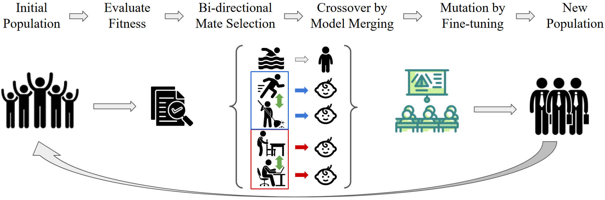

# SESiL: Social, Evolutionary supported Learning



This is the official implementation of **SESiL** from our paper:
**[SESiL: Social, Evolutionary supported Learning](https://dl.acm.org/doi/abs/10.65109/LPWP5477) @ AAMAS 2026**.\
Our codebase is built on the one for **ZipIt! Merging Models from Different Tasks without Training @ ICLR 2024**.\
Check their repository for more details_[GitHub](https://github.com/gstoica27/ZipIt).

### Installation
Create a virtual environment and install the dependencies:
```bash
conda create -n sesil python=3.7
conda activate sesil
pip install torch torchvision torchaudio
pip install -r requirements.txt
```

### Usage
In the folder ```checkpoints``` that includes all the baseline models as well as the corresponding pretrained models in ```initial``` folders for initial populations. Copy and paste the initial population you need to where the training script asks for it and the evolution will start there. New generations (models) and their performance (.csv files) will be automatically collected.

Training models for an experimental suite is straightforward. You can find existing training scripts under the "training_scripts" directory. This contains training scripts for SESiL with different merging methods and different problem sets. Each file in the directory is self contained, and provides instructions for training. For instance, one can train SESiL with Permutation merging on CIFAR by running
```
$bash: python -m training_scripts.evolutionary_permute_training
```

Hyper-parameters can be changed within the script. You can also select which generation to start with, respecting to the existing population folder of the previous generation, even thought the run is somehow interrupted. Moreover, all the experimental results are included, you can use "train_script/make_figures.py" to reproduce the graphs, if needed.

## Citation

If you use SESiL or this codebase in your work, please cite:
```
@inproceedings{zhao2026sesil,
author = {Zhao, Tianshu and Rabinovich, Zinovi},
title = {SESiL: Social, Evolutionary Supported Learning},
year = {2026},
publisher = {International Foundation for Autonomous Agents and Multiagent Systems},
doi = {10.65109/LPWP5477},
booktitle = {Proceedings of the 25th International Conference on Autonomous Agents and Multiagent Systems},
pages = {2160–2168},
numpages = {9}
}
```

